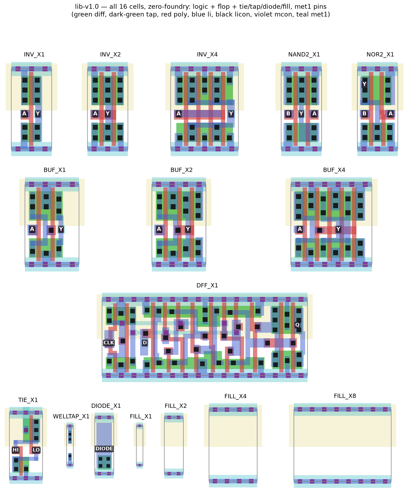

# stdcells — CORDIC-1 on my own standard-cell library

Proof leg of the full-stack goal (see `../devphys`): re-implement the
taped-out CORDIC-1 chip using a **self-designed standard-cell library** —
every transistor chosen, sized from measured device behavior, characterized
with our own tooling — and compare PPA against the foundry library version
that went to fabrication (TTSKY26c, commit b646d057).

## Chain (all open source)

1. **Device probe** (`flow/device_probe.py`): measure sky130 n/pFET drive
   currents in ngspice → transistor sizing rules for the library.
2. **Cell netlists** (`flow/cells.py`): 9 characterized static-CMOS
   cells at transistor level (INV x3, BUF x3, NAND2, NOR2, DFF), one
   entry per physical finger, generated with the measured sizing —
   plus 7 physical-only cells (tie/tap/diode/fill) in `flow/layout.py`.
3. **Own characterizer** (`flow/characterize.py`): ngspice transient
   measurements → NLDM Liberty + Verilog models. Delays, transitions, input
   caps, leakage, clk→Q, setup — all measured by us, at **each of the three
   sky130A signoff corners** (`out/own_tt_025C_1v80.lib`,
   `own_ss_100C_1v60.lib`, `own_ff_n40C_1v95.lib`; `own.lib` remains the
   nominal one). See *Timing corners* below for why one PVT was not enough.
4. **Synthesis PPA comparison** (`flow/synth_compare.py`): yosys+ABC maps
   the REAL CORDIC-1 RTL (`../tt-cordic/src`) to (a) `own.lib` and
   (b) `sky130_fd_sc_hd tt` → `out/REPORT.md`.
5. **Cell layouts** (`flow/layout.py`, gdstk) → KLayout DRC
   (`flow/run_drc_all.py`, official `sky130A_mr.drc` deck) + LVS
   (`flow/run_lvs_all.py`, official `sky130.lvs` deck) → LEF abstracts
   (`flow/make_lef.py`, exact pin/OBS rectangle decompositions from the
   signoff GDS).
6. **Hardening** (`flow/make_hardening.py` → `harden/`): the all-own
   netlist (our combinational cells AND our DFF_X1) placed & routed by
   LibreLane in CI on the TinyTapeout 1x1 tile.
7. **Magic-native views** (`flow/magic_views.tcl` + the `magic-views`
   workflow): `.mag`/`.maglef` per cell + magic DRC held to foundry-cell
   parity.

## Results — CORDIC-1 synthesis PPA (library v2)

Same taped-out RTL, same yosys+ABC flow, two Liberty targets:

| metric | **own library** | sky130_fd_sc_hd | ratio own/hd |
|---|---|---|---|
| mapped cells | 1782 | 969 | 1.84 |
| chip area (µm²; all own areas from signoff layouts) | 9 106 | 8 139 | **1.12** |
| ABC critical path (ps) | **1 890** | 3 525 | **0.54** |
| meets the tapeout's 50 MHz | YES | YES | — |

**v2 is the library the phase-6 routing failure demanded.** v1 sized for
symmetric edges (Wp = 2.61×Wn, measured) and proved DRC/LVS-clean — then
detailed routing rejected it: the fat folded PMOS closes the cell
mid-band, so input pins have no in-cell access point (DRT-0073; tag
`v1-symmetric-drive`, 2.17× hd area). v2 rebuilds every cell at
Wp=1.0/Wn=0.65 single-finger — the sky130_fd_sc_hd architecture, studied
from the PDK GDS and re-implemented generatively in `flow/layout.py` —
which opens the mid-band and puts **every pin at y≈1.19, clear of both
rail shadows**. All 7 cells came out DRC-clean in TWO iterations and
LVS-matched with zero netlist overrides (`flow/cells.py` now carries one
device per physical finger). Cell areas equal the foundry's exactly
(3/3/5/4/6/3/3 sites), and the full-design area penalty collapsed from
2.17× to 1.09×.

The library is 16 cells: 9 characterized — INV_X1/X2/X4, BUF_X1/X2/X4,
NAND2, NOR2, DFF_X1 — plus 7 physical-only cells that complete
self-sufficiency: TIE_X1 (cross-coupled 2T tie), WELLTAP_X1, DIODE_X1
(antenna), FILL_X1–X8. (NOR3 and NAND3 were *dropped* after routing-cost
analysis — library design is economics; their instances remap to
NAND2/NOR2 chains and the cost above is measured, not hidden.) LVS earned its keep in
v1 by catching a double-width NFET in the BUF cells that DRC could never
see; in v2 the extractor's multifinger merge is mirrored in the reference
netlists (`flow/run_lvs_all.py`).

## Hardening result (phase 6, v2)

LibreLane P&R of the hybrid netlist (our 7 cells + hd `dfxtp_1`) at 20 ns:
**routed with 0 violations — the v1 DRT-0073 pin-access blocker is dead**
— antenna-clean, and **timing met at every corner** (worst setup slack
+3.46 ns at ss/1.60 V, worst hold +0.11 ns at ff/1.95 V). The final GDS
passes the **full official KLayout deck (FEOL+BEOL+offgrid) with 0
violations** after one deterministic post-processing step:
`flow/heal_hvtp.py` bridges 36 corner-pinches in the foundry cells' hvtp
implant — an abutment case (hd band ending/starting at the same x in
mirrored rows) that only arises when hvtp-less custom cells interleave
with hd cells; the added implant is diamond-shaped, diff-free and
electrically inert, and the healed GDS is re-checked by the full deck.
Magic's DRC/LVS are demoted to warnings in `harden/config.json`: magic's
CIF read of GDS-only custom cells reports tens of thousands of phantom
errors on a layout the official KLayout deck proves clean; the
magic-native views (section below) later reduced the disagreement to
exactly the tap/latch-up rules every standalone cell shows.

**And it fits the tile — with every sequential and logic cell our own.**
With the die pinned to the exact TinyTapeout 1x1 footprint the
fabricated chip used (161.00 × 111.52 µm), the all-own netlist (1787 own
cells incl. 191 DFF_X1; only the 18 tie cells remain foundry) places,
routes, and passes the full signoff deck with 0 violations — final hold
slack +0.006 ns and setup +12.3 ns at the worst corners, 87% utilization.
**Zero-foundry milestone (lib-v1.0):** the flow-inserted cells are now
ours too — TIE_X1 (cross-coupled 2T tie), WELLTAP_X1, DIODE_X1 (with
LEF antenna area), FILL_X1–X8, CTS on our buffers, `sky130_fd_sc_hd__*`
banned from P&R outright. The chip contains **zero foundry cells**:
signoff DRC 0, hold +0.016 ns / setup +13.4 ns, 65% utilization. The
decisive architectural fix: **all signal pins moved to met1** (in-cell
mcon + pad) — after three rounds of DRT-vs-deck li disagreements
(same-net via pairs, rail-stub proximity), taking li out of the
router's reach entirely killed the class. The library is consumed by
downstream chips as pinned release tags (`lib-v1.0`).

Hard-won tuning lessons along the way: (1) a fast library makes hold
*overfixing* expensive — the default 0.1 ns resizer margin × our 171 ps
buffers meant hundreds of repair buffers; trim to ~0.005–0.02 ns.
(2) Our DFF_X1 is ~150 ps faster at clk→Q than the foundry flop, which
shortens every min-path and roughly quadruples hold repair — a fast flop
is not free. (3) The decisive lever was none of that: LibreLane's
default core margins (4/4/12/12 site-multiples) quietly spend 25% of a
1x1 tile; at 1/1/2/2 the core grows 13.5k → 16.9k µm². (4) A weak
"hold buffer" cell (BUF_X1, now in the library) does NOT win OpenROAD's
hold-buffer selection: the delay/area metric is evaluated at light load,
where a weak output stage has no delay advantage.

## Magic-native views

`flow/magic_views.tcl` + the `magic-views` CI workflow load the signoff
GDS into magic (LibreLane container), emit `.mag`/`.maglef` views, and
run magic's full per-cell DRC judged against a **foundry control group**:
hd's own `inv_1`/`dfxtp_1` are checked standalone first, and our cells
must show no rule category beyond theirs (the tap/latch-up rules every
tapless cell shows — resolved by tap cells at chip level). Status:
**PASS**. Getting there took two real fixes: the generated cells needed
the `areaid.standardc` (81/4) marker (magic relaxes contact-to-gate to
the 0.05 µm standard-cell rule only inside it), and magic caught a
genuine 45 nm contact-to-gate violation in BUF_X2 that the KLayout
deck's rule formulation misses — the two checkers are complementary,
which is exactly why shuttles run both.

## Custom DFF

`flow/make_dff.py` completes the library: it takes the silicon-proven
`dfxtp_1` polygons and **drops the hvtp implant layer**, which converts
every pfet to the svt flavor this library is built on — then the result
goes through the same signoff as every hand-generated cell: official-deck
DRC (clean), KLayout LVS against the 24T netlist transcribed in
`cells.py` (MATCH; the four 'special' pass nfets are normalized by the
deck itself), our characterizer (clk→Q 351 ps, setup ≈ 0, D pin 1.11 fF),
our LEF. The hybrid era is over.

(Historical note: v1 and early v2 hardened with a hybrid library —
our combinational cells + the foundry flop — because the v1 template made
a custom DFF structurally impossible. That analysis is preserved in
`PLAN.md`.)

What v2 keeps from the measurements: **svt PMOS** (1.37× hvt drive,
measured) — the ~2× shorter synthesis-level critical path is that choice,
(An earlier ~4× figure was an artifact of a liberty unit bug: the load
axis was written in fF against a declared pF unit, so STA extrapolated
far below the characterized range. Found when TritonCTS refused the
tables outright; every timing number since has been re-derived.)
paid for in PMOS-off leakage (BUF_X2 ~1 nW vs single-digit pW NAND/INV
states, measured). What v2 gives up: symmetric edges (rise is ~1.7× slow)
and stack compensation (NAND2 251 ps vs INV_X1 195 ps mid-table) —
characterized honestly, not hidden. Details and cell mix:
[`out/REPORT.md`](out/REPORT.md). Every transistor's W/L:
[`out/own.spice`](out/own.spice) / rules in [`out/sizing.json`](out/sizing.json).

## Status

- Phases 1–5 (probe → cells → characterize → compare → layout/DRC/LVS/LEF)
  run natively on Windows (ngspice + oss-cad-suite yosys + KLayout + the
  ciel-managed sky130A PDK); P&R and the magic checks run in CI via the
  LibreLane container (`harden` + `magic-views` workflows, both green).
- All 16 cells have REAL signoff layouts; every cell is DRC-clean
  (official KLayout deck), LVS-matched where devices exist, and at
  foundry-cell parity under magic DRC. Signal pins are on met1
  (in-cell mcon + pad) — the router never touches li.
- Library v1 (symmetric-drive experiment) is preserved at tag
  `v1-symmetric-drive`; its post-mortem is in `PLAN.md`.
- Zero-foundry leg COMPLETE and released as **`lib-v1.0`** — the only
  foundry content left is the interconnect definition itself.
- **`lib-v1.1` — multi-PVT timing.** Every cell is now characterized at
  all three sky130A signoff corners (`tt_025C_1v80`, `ss_100C_1v60`,
  `ff_n40C_1v95`), and the hardening config feeds them through the
  corner-keyed `LIB` variable instead of the single-corner `EXTRA_LIBS`,
  which LibreLane loads "indiscriminately for all timing corners". Before
  this, the nine STA corners (and their SDF) were byte-identical, so a
  measured-vs-predicted silicon gap on the vertical-slice ring
  oscillators had no corner spread to be attributed to. Fixing it
  surfaced two real defects the single-PVT flow had hidden: the DFF
  clk→Q measurement assumed the flop powered up with Q=0 (true at tt,
  false at ff → NaN tables), and `characterize.py` could not be imported
  without running the whole flow. `flow/check_corner_spread.py` now
  asserts, in CI, that the corners actually differ. See *Timing corners*.

### Timing corners (lib-v1.1)

`flow/characterize.py` re-measures the full library at each corner
(`python characterize.py` does all three; pass a corner name for one).
The delay spread is real — ss/ff ≈ 2× — and it is what turns a cold-vs-
warm ring-oscillator measurement in silicon into an attributable result
rather than a single number with no error bar. The DFF captures are now
each measured from a run preconditioned into the opposite state, so the
answer cannot depend on the power-up state; the nominal corner still
reproduces lib-v1.0 exactly (clk→Q 351 ps, setup ≈ 0).

- Next legs: the vertical-slice tapeout consumes a pinned tag; then v3
  cells on devphys-derived custom device geometries; internal-power
  (dynamic energy) characterization is the known remaining gap in the
  Liberty views.

## PVT analysis — custom library vs sky130_fd_sc_hd

`flow/pvt_compare.py` compares the custom library (`lib-v1.1`, three PVT
corners) against the foundry `sky130_fd_sc_hd`, cell-for-cell on the same
sky130 process. Every delay is the `cell_rise` propagation delay
bilinear-interpolated from each cell's NLDM table to **one common operating
point — input slew 0.30 ns, output load 0.025 pF — used identically for both
libraries**. The point lands inside every table's index range (no clamping);
on the custom lib it hits a grid node exactly, on hd it interpolates. The
custom cells are single-Vt **svt** ("fast/fat/leaky by design"); hd is a
production multi-Vt-capable library — so expect the custom cells faster but
leakier at nominal. Reproduce with `python flow/pvt_compare.py`.

### Delay — `cell_rise` at 0.30 ns / 0.025 pF  [ps]

| cell  | own tt | own ss | own ff | hd tt | hd ss | hd ff |
|-------|-------:|-------:|-------:|------:|------:|------:|
| INV   | 265.6  | 310.7  | 250.0  | 284.7 | 371.9 | 234.9 |
| NAND2 | 267.0  | 313.0  | 250.9  | 305.4 | 418.9 | 250.3 |
| NOR2  | 410.6  | 511.7  | 371.1  | 461.0 | 712.5 | 348.5 |
| DFF   | 351.2  | 505.3  | 273.2  | 524.0 | 959.6 | 339.2 |

DFF = CLK→Q `rising_edge` arc; gates = first input arc. Delays order **ss >
tt > ff** for every cell in both libraries. The custom svt cells are faster
than hd at the nominal (tt) and slow (ss) corners for every cell — most
dramatically the flip-flop: **CLK→Q 351 vs 524 ps at tt, and 505 vs 960 ps at
the timing-critical ss corner (~1.9× faster)**. At the fast ff corner the lead
narrows or reverses for the simple gates (hd INV 234.9 beats own 250.0 ps),
but ff is the best-case corner and rarely sets the clock.

### Corner spread — delay(ss) / delay(ff)

| cell  |   own |    hd |
|-------|------:|------:|
| INV   | 1.243 | 1.583 |
| NAND2 | 1.247 | 1.673 |
| NOR2  | 1.379 | 2.045 |
| DFF   | 1.850 | 2.829 |

At this operating point the custom cells' delay swings less across the process
box than hd's. Read it as a measured comparison **at 0.30 ns / 0.025 pF**, not
a universal robustness claim: a fixed input slew adds a corner-independent
component that compresses the ratio, and a ring oscillator runs at a much
lighter load and faster slew than this point.

### Leakage — `cell_leakage_power` per corner  [nW]

| cell  | own tt  | own ss  | own ff  | hd tt   | hd ss    | hd ff   |
|-------|--------:|--------:|--------:|--------:|---------:|--------:|
| INV   | 0.00346 | 0.00708 | 0.00383 | 0.00533 | 4.02642  | 0.00315 |
| NAND2 | 0.00336 | 0.00336 | 0.00383 | 0.00212 | 2.26812  | 0.00312 |
| NOR2  | 0.00692 | 0.01417 | 0.00766 | 0.00197 | 2.11692  | 0.00325 |
| DFF   | 1.06451 | 6.21589 | 0.27534 | 0.00844 | 14.65205 | 0.01452 |

Both libraries declare `leakage_power_unit : "1nW"`. **Caveat:** the custom
values are measured in a *single input state at a single operating point*, so
they are a **lower bound** — a companion internal-power analysis estimates
single-state measurement understates the state-averaged figure ~27–53×, and it
shows here as an unphysically *flat* temperature trend (own NAND2 is identical
at tt and ss). hd's foundry data captures the full ~100 °C subthreshold rise
(hd INV climbs ~750× to 4.0 nW at ss). **Do not read the `ss` columns as the
custom cells out-leaking hd** — that reversal is the measurement gap, not a
real advantage. The comparable, honest takeaway is at **tt**, where even a
lower bound already exceeds hd: the svt cells leak more by design — the DFF
~126× more than hd (1.065 vs 0.0084 nW). Full state-averaged leakage is the
known open gap (see *Next legs*).

### Area  [µm²]

Per-cell area is **identical** — the custom cells are drawn to the same
standard-cell footprints (site widths) as their hd counterparts for drop-in
compatibility: INV/NAND2/NOR2 = 3.7536, DFF = 20.0192 in both. Any
library-level density gap vs hd is a placement / cell-count effect, not
per-cell.

**For the vertical-slice silicon experiment:** the three-corner
characterization gives each cell a concrete tt→ss→ff delay envelope, so the
fabricated ring-oscillator frequency can be checked against a predicted *band*
rather than a single number — a reading outside the envelope flags a
mischaracterized model rather than ordinary process spread. (The RO's own
operating point is lighter-load / faster-slew than this table's.)

## Requirements

sky130A PDK via `pip install ciel; ciel enable --pdk-family sky130 <ver>`;
ngspice (see `../devphys/tools`); oss-cad-suite yosys; KLayout ≥ 0.30
(DRC/LVS decks run headless); gdstk + matplotlib (layout generation and
the contact sheet).
