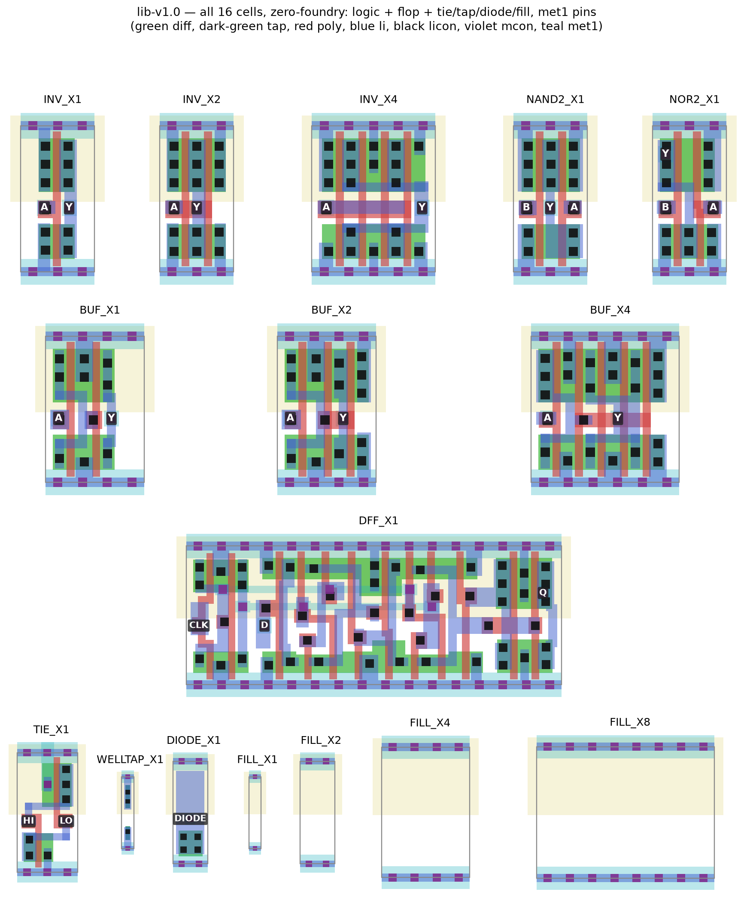

# stdcells — CORDIC-1 on my own standard-cell library

Proof leg of the full-stack goal (see `../devphys`): re-implement the
taped-out CORDIC-1 chip using a **self-designed standard-cell library** —
every transistor chosen, sized from measured device behavior, characterized
with our own tooling — and compare PPA against the foundry library version
that went to fabrication (TTSKY26c, commit b646d057).

## Chain (all open source)

1. **Device probe** (`flow/device_probe.py`): measure sky130 n/pFET drive
   currents in ngspice → transistor sizing rules for the library.
2. **Cell netlists** (`flow/cells.py`): 9 characterized static-CMOS
   cells at transistor level (INV x3, BUF x3, NAND2, NOR2, DFF), one
   entry per physical finger, generated with the measured sizing —
   plus 7 physical-only cells (tie/tap/diode/fill) in `flow/layout.py`.
3. **Own characterizer** (`flow/characterize.py`): ngspice transient
   measurements → NLDM Liberty + Verilog models. Delays, transitions, input
   caps, leakage, clk→Q, setup — all measured by us, at **each of the three
   sky130A signoff corners** (`out/own_tt_025C_1v80.lib`,
   `own_ss_100C_1v60.lib`, `own_ff_n40C_1v95.lib`; `own.lib` remains the
   nominal one). See *Timing corners* below for why one PVT was not enough.
4. **Synthesis PPA comparison** (`flow/synth_compare.py`): yosys+ABC maps
   the REAL CORDIC-1 RTL (`../tt-cordic/src`) to (a) `own.lib` and
   (b) `sky130_fd_sc_hd tt` → `out/REPORT.md`.
5. **Cell layouts** (`flow/layout.py`, gdstk) → KLayout DRC
   (`flow/run_drc_all.py`, official `sky130A_mr.drc` deck) + LVS
   (`flow/run_lvs_all.py`, official `sky130.lvs` deck) → LEF abstracts
   (`flow/make_lef.py`, exact pin/OBS rectangle decompositions from the
   signoff GDS).
6. **Hardening** (`flow/make_hardening.py` → `harden/`): the all-own
   netlist (our combinational cells AND our DFF_X1) placed & routed by
   LibreLane in CI on the TinyTapeout 1x1 tile.
7. **Magic-native views** (`flow/magic_views.tcl` + the `magic-views`
   workflow): `.mag`/`.maglef` per cell + magic DRC held to foundry-cell
   parity.

## Results — CORDIC-1 synthesis PPA (library v2)

Same taped-out RTL, same yosys+ABC flow, two Liberty targets:

| metric | **own library** | sky130_fd_sc_hd | ratio own/hd |
|---|---|---|---|
| mapped cells | 1782 | 969 | 1.84 |
| chip area (µm²; all own areas from signoff layouts) | 9 106 | 8 139 | **1.12** |
| ABC critical path (ps) | **1 890** | 3 525 | **0.54** |
| meets the tapeout's 50 MHz | YES | YES | — |

**v2 is the library the phase-6 routing failure demanded.** v1 sized for
symmetric edges (Wp = 2.61×Wn, measured) and proved DRC/LVS-clean — then
detailed routing rejected it: the fat folded PMOS closes the cell
mid-band, so input pins have no in-cell access point (DRT-0073; tag
`v1-symmetric-drive`, 2.17× hd area). v2 rebuilds every cell at
Wp=1.0/Wn=0.65 single-finger — the sky130_fd_sc_hd architecture, studied
from the PDK GDS and re-implemented generatively in `flow/layout.py` —
which opens the mid-band and puts **every pin at y≈1.19, clear of both
rail shadows**. All 7 cells came out DRC-clean in TWO iterations and
LVS-matched with zero netlist overrides (`flow/cells.py` now carries one
device per physical finger). Cell areas equal the foundry's exactly
(3/3/5/4/6/3/3 sites), and the full-design area penalty collapsed from
2.17× to 1.09×.

The library is 16 cells: 9 characterized — INV_X1/X2/X4, BUF_X1/X2/X4,
NAND2, NOR2, DFF_X1 — plus 7 physical-only cells that complete
self-sufficiency: TIE_X1 (cross-coupled 2T tie), WELLTAP_X1, DIODE_X1
(antenna), FILL_X1–X8. (NOR3 and NAND3 were *dropped* after routing-cost
analysis — library design is economics; their instances remap to
NAND2/NOR2 chains and the cost above is measured, not hidden.) LVS earned its keep in
v1 by catching a double-width NFET in the BUF cells that DRC could never
see; in v2 the extractor's multifinger merge is mirrored in the reference
netlists (`flow/run_lvs_all.py`).

## Hardening result (phase 6, v2)

LibreLane P&R of the hybrid netlist (our 7 cells + hd `dfxtp_1`) at 20 ns:
**routed with 0 violations — the v1 DRT-0073 pin-access blocker is dead**
— antenna-clean, and **timing met at every corner** (worst setup slack
+3.46 ns at ss/1.60 V, worst hold +0.11 ns at ff/1.95 V). The final GDS
passes the **full official KLayout deck (FEOL+BEOL+offgrid) with 0
violations** after one deterministic post-processing step:
`flow/heal_hvtp.py` bridges 36 corner-pinches in the foundry cells' hvtp
implant — an abutment case (hd band ending/starting at the same x in
mirrored rows) that only arises when hvtp-less custom cells interleave
with hd cells; the added implant is diamond-shaped, diff-free and
electrically inert, and the healed GDS is re-checked by the full deck.
Magic's DRC/LVS are demoted to warnings in `harden/config.json`: magic's
CIF read of GDS-only custom cells reports tens of thousands of phantom
errors on a layout the official KLayout deck proves clean; the
magic-native views (section below) later reduced the disagreement to
exactly the tap/latch-up rules every standalone cell shows.

**And it fits the tile — with every sequential and logic cell our own.**
With the die pinned to the exact TinyTapeout 1x1 footprint the
fabricated chip used (161.00 × 111.52 µm), the all-own netlist (1787 own
cells incl. 191 DFF_X1; only the 18 tie cells remain foundry) places,
routes, and passes the full signoff deck with 0 violations — final hold
slack +0.006 ns and setup +12.3 ns at the worst corners, 87% utilization.
**Zero-foundry milestone (lib-v1.0):** the flow-inserted cells are now
ours too — TIE_X1 (cross-coupled 2T tie), WELLTAP_X1, DIODE_X1 (with
LEF antenna area), FILL_X1–X8, CTS on our buffers, `sky130_fd_sc_hd__*`
banned from P&R outright. The chip contains **zero foundry cells**:
signoff DRC 0, hold +0.016 ns / setup +13.4 ns, 65% utilization. The
decisive architectural fix: **all signal pins moved to met1** (in-cell
mcon + pad) — after three rounds of DRT-vs-deck li disagreements
(same-net via pairs, rail-stub proximity), taking li out of the
router's reach entirely killed the class. The library is consumed by
downstream chips as pinned release tags (`lib-v1.0`).

Hard-won tuning lessons along the way: (1) a fast library makes hold
*overfixing* expensive — the default 0.1 ns resizer margin × our 171 ps
buffers meant hundreds of repair buffers; trim to ~0.005–0.02 ns.
(2) Our DFF_X1 is ~150 ps faster at clk→Q than the foundry flop, which
shortens every min-path and roughly quadruples hold repair — a fast flop
is not free. (3) The decisive lever was none of that: LibreLane's
default core margins (4/4/12/12 site-multiples) quietly spend 25% of a
1x1 tile; at 1/1/2/2 the core grows 13.5k → 16.9k µm². (4) A weak
"hold buffer" cell (BUF_X1, now in the library) does NOT win OpenROAD's
hold-buffer selection: the delay/area metric is evaluated at light load,
where a weak output stage has no delay advantage.

## Magic-native views

`flow/magic_views.tcl` + the `magic-views` CI workflow load the signoff
GDS into magic (LibreLane container), emit `.mag`/`.maglef` views, and
run magic's full per-cell DRC judged against a **foundry control group**:
hd's own `inv_1`/`dfxtp_1` are checked standalone first, and our cells
must show no rule category beyond theirs (the tap/latch-up rules every
tapless cell shows — resolved by tap cells at chip level). Status:
**PASS**. Getting there took two real fixes: the generated cells needed
the `areaid.standardc` (81/4) marker (magic relaxes contact-to-gate to
the 0.05 µm standard-cell rule only inside it), and magic caught a
genuine 45 nm contact-to-gate violation in BUF_X2 that the KLayout
deck's rule formulation misses — the two checkers are complementary,
which is exactly why shuttles run both.

## Custom DFF

`flow/make_dff.py` completes the library: it takes the silicon-proven
`dfxtp_1` polygons and **drops the hvtp implant layer**, which converts
every pfet to the svt flavor this library is built on — then the result
goes through the same signoff as every hand-generated cell: official-deck
DRC (clean), KLayout LVS against the 24T netlist transcribed in
`cells.py` (MATCH; the four 'special' pass nfets are normalized by the
deck itself), our characterizer (clk→Q 351 ps, setup ≈ 0, D pin 1.11 fF),
our LEF. The hybrid era is over.

(Historical note: v1 and early v2 hardened with a hybrid library —
our combinational cells + the foundry flop — because the v1 template made
a custom DFF structurally impossible. That analysis is preserved in
`PLAN.md`.)

What v2 keeps from the measurements: **svt PMOS** (1.37× hvt drive,
measured) — the ~2× shorter synthesis-level critical path is that choice,
(An earlier ~4× figure was an artifact of a liberty unit bug: the load
axis was written in fF against a declared pF unit, so STA extrapolated
far below the characterized range. Found when TritonCTS refused the
tables outright; every timing number since has been re-derived.)
paid for in PMOS-off leakage (BUF_X2 ~1 nW vs single-digit pW NAND/INV
states, measured). What v2 gives up: symmetric edges (rise is ~1.7× slow)
and stack compensation (NAND2 251 ps vs INV_X1 195 ps mid-table) —
characterized honestly, not hidden. Details and cell mix:
[`out/REPORT.md`](out/REPORT.md). Every transistor's W/L:
[`out/own.spice`](out/own.spice) / rules in [`out/sizing.json`](out/sizing.json).

## Status

- Phases 1–5 (probe → cells → characterize → compare → layout/DRC/LVS/LEF)
  run natively on Windows (ngspice + oss-cad-suite yosys + KLayout + the
  ciel-managed sky130A PDK); P&R and the magic checks run in CI via the
  LibreLane container (`harden` + `magic-views` workflows, both green).
- All 16 cells have REAL signoff layouts; every cell is DRC-clean
  (official KLayout deck), LVS-matched where devices exist, and at
  foundry-cell parity under magic DRC. Signal pins are on met1
  (in-cell mcon + pad) — the router never touches li.
- Library v1 (symmetric-drive experiment) is preserved at tag
  `v1-symmetric-drive`; its post-mortem is in `PLAN.md`.
- Zero-foundry leg COMPLETE and released as **`lib-v1.0`** — the only
  foundry content left is the interconnect definition itself.
- **`lib-v1.1` — multi-PVT timing.** Every cell is now characterized at
  all three sky130A signoff corners (`tt_025C_1v80`, `ss_100C_1v60`,
  `ff_n40C_1v95`), and the hardening config feeds them through the
  corner-keyed `LIB` variable instead of the single-corner `EXTRA_LIBS`,
  which LibreLane loads "indiscriminately for all timing corners". Before
  this, the nine STA corners (and their SDF) were byte-identical, so a
  measured-vs-predicted silicon gap on the vertical-slice ring
  oscillators had no corner spread to be attributed to. Fixing it
  surfaced two real defects the single-PVT flow had hidden: the DFF
  clk→Q measurement assumed the flop powered up with Q=0 (true at tt,
  false at ff → NaN tables), and `characterize.py` could not be imported
  without running the whole flow. `flow/check_corner_spread.py` now
  asserts, in CI, that the corners actually differ. See *Timing corners*.
- **`lib-v1.2` — internal power, per-state leakage, RO-interior grid.** The NLDM
  grid gained a fast-slew (20 ps) and low-load (2 fF) point so the vertical-slice
  ring oscillator's operating point (~50 ps, ~3.6 fF) is *interior* to the index
  box instead of extrapolated below it. Each combinational cell now emits
  `internal_power` (rise/fall switching energy in pJ, validated against the
  E = supply − ½·C·Vdd² shape sky130_fd_sc_hd ships) and per-state
  `leakage_power(when)` (the old all-low measurement understated an inverter's
  average ~74×); `cell_leakage_power` is the average over states. The hardened
  netlist is byte-identical to lib-v1.1 — only the timing/power views changed.
- **`lib-v1.3` — load-monotonicity guard + honest documentation.**
  `flow/check_monotonic.py` asserts, in CI, that delay is monotonic in *output
  load* — physically unconditional, and the property STA leans on for a fixed
  driver — across every corner. It deliberately does *not* require
  slew-monotonicity: these cells are asymmetric (WP 1.0 > WN 0.65 µm, the
  routability sizing), so the 50-50 delay legitimately goes negative and shrinks
  with a slower input ramp — the output trips before the input reaches 50 %
  (waveform-confirmed: INV_X4 cell_fall at ff/1.5 ns/2 fF is −96 ps). Those
  entries are physical, present since lib-v1.0, confined to a light-load/fast-
  cell/slow-input region the design never signs off on, and are emitted unclamped
  rather than fabricated into monotonicity. No re-characterization; the
  vertical-slice pin is unaffected.
- **`lib-v1.4` — defect M11: the output-transition tables were measured by
  crossing ordinal, not by direction.** Every `rise_transition`/`fall_transition`
  table of the five *inverting* cells (INV_X1/X2/X4, NAND2_X1, NOR2_X1) was
  negative **and exchanged with its partner**. `.meas ... cross=N` counts the Nth
  crossing of a level in *either* direction, and both thresholds of a transition
  measurement sit on the *same* node, so on a cell whose output falls when its
  input rises the 0.8·Vdd crossing precedes the 0.2·Vdd one and `targ − trig`
  runs backwards. The delay arcs were never affected — their `trig` is
  direction-qualified on the *input* — and the DFF was never affected because
  `_dff_edge` has always used `rise=`/`fall=`. Fixed by measuring the same way
  everywhere.
  - **It was not a sign error.** The magnitudes were all present, on the wrong
    tables: at (20 ps, 2 fF, tt) INV_X1 shipped −11.30 ps as `rise_transition`
    when its rise is **20.97 ps**, and **NOR2_X1 understated its rise by 3.2×**
    (15.68 vs **50.87 ps**) — the cell with the stacked-PMOS pull-up, and the
    slowest ring on the vertical-slice die. An `abs()` would have left both wrong.
  - **Why nothing caught it for four releases, and what now does.** OpenSTA does
    not reject a negative transition, it *clamps* it, so vertical-slice signed
    off with 20 of 21 driver rows at **zero input slew** and a "max slew
    violations 0" that asserted nothing. `check_monotonic.py` — the guard whose
    own docstring says a wrong-crossing regression "almost always breaks"
    load-monotonicity — parsed only `cell_rise`/`cell_fall`. It now covers all
    four tables and additionally asserts that transitions are **positive**, a
    check available precisely *because* it is unavailable for delay (see
    `lib-v1.3`: negative 50-50 delays here are real and deliberately unclamped,
    so "a negative number in the liberty" could never have been the alarm).
    Against the shipped library the extended guard reports **672 non-positive
    transition values and 502 load-direction violations**; against this one, 0
    and 0.
  - **Blast radius is exactly the defect.** Re-characterizing all three corners
    changes **14 value tables per corner and nothing else** — the 5 inverting
    cells' 7 `rise_transition` + 7 `fall_transition` tables. Every delay, power,
    leakage, capacitance, area and setup/hold table is byte-identical, BUF and
    DFF are untouched in full, and `harden/cordic_gates.v` re-synthesizes
    **byte-identical** (1805 own cells, 0 foundry). This is a timing-view
    correction, not a design change.
  - Downstream: vertical-slice must re-pin and re-harden, and its
    `flow/ring_prediction.py` `abs()` workaround becomes a no-op. Its published
    ring numbers **will move** — it was driving every stage with the
    wrong-direction slew — so reproducing them would mean the fix had not taken.
    `flow/v3/xcheck_liberty.py` scales `fall_transition` as a pull-down (NMOS)
    arc, which for the inverting cells was the PMOS pull-up; regenerate
    `out/own_devphys_xcheck.lib` from this release.
- **`lib-v1.5` — defects M15 and M16: two attributes the tool never read.**
  Neither was a wrong number. In both cases the measured data was correct and
  present in the file, addressed so that OpenSTA never looked at it — and
  every downstream check therefore reported a comfortable constant.
  - **M15 — the library declared no fanout load at all.** OpenSTA computes a
    net's fanout by summing `fanout_load` over its sink pins, falling back to
    the library's `default_fanout_load`. This library emitted neither, so
    every net in every design summed to **0.0**, `set_max_fanout 10` could not
    be exceeded by any circuit whatsoever, and
    `design__max_fanout_violation__count` was a constant. vertical-slice had
    that metric in its `MUST_BE_ZERO` list and quoted it as assurance — the
    sixth guard in this project found to be asserting a proxy, and the first
    that had been promoted to a signoff gate before anyone checked it could
    fail. Fixed with one header line, `default_fanout_load : 1;`.
  - **What it was hiding**, measured on the shipped routed netlist of
    vertical-slice run 30942289282: **22 driver pins over the limit**, worst
    `wire82/Y` at fanout **29** against 10. And the mechanism is visible in
    the violators' own names — `max_cap75..83`, `load_slew29..72`, `wire31..82`
    are buffers OpenROAD's `repair_design` inserted to fix capacitance and
    slew, which it then loaded with 20-29 sinks apiece **because the fanout
    limit was invisible to the repair engine too**. The repair pass created
    the nets that violate.
  - **It is also M9's root cause.** The two max-capacitance violators at tt
    are `wire82/Y` and `max_cap79/Y` — both in that fanout list, at 29 and 27
    sinks. ~62 fF of pin load before a micron of wire, against a 100 fF limit.
    Nothing enforced fanout, so nothing ever split them.
  - **Why `default_fanout_load : 1` and deliberately nothing else.**
    `sky130_fd_sc_hd` — the reference for what is conventional — carries
    exactly this attribute, and has **no** per-pin `fanout_load` and **no**
    `max_fanout` anywhere. Both alternatives were built and measured here:
    per-pin `fanout_load : 1` on all 14 input pins is exactly redundant with
    the header default (identical violation report), and a per-output
    `max_fanout : N` was rejected on purpose — it would be a second source of
    truth racing the SDC's design-level limit, and N would be a number nobody
    measured sitting in a characterized library beside the `max_capacitance`
    that *is* measured. Fanout is the crude proxy; capacitance is the real
    limit. Keeping the load at exactly 1 per pin also keeps "fanout" meaning
    "sink count", which is what `set_max_fanout 10` and every recorded
    violation figure assume.
  - **M16 — every `internal_power` table was silently discarded.** The power
    grid template was declared with `lu_table_template` when Liberty keeps
    power templates in a **separate namespace** requiring `power_lut_template`,
    so all 18 tables resolved to nothing. OpenSTA said so, in 18 warnings, on
    every read, for four library releases. Measured: reported internal power
    **0.00e+00 before, 5.47e-08 after** — a third of total power. Found while
    proving M15, purely because someone finally read the log.
  - **The guard: `flow/check_liberty_sta.py`, and why it is not
    `check_monotonic.py`.** That guard reads the liberty's *numbers*, and
    could never have caught either defect, because both numbers were right;
    what was wrong was whether the consuming tool could reach them — a
    property of the liberty and the tool *together*, observable only by
    running the tool. So the new guard runs OpenSTA on a netlist carrying a
    12-sink and a 9-sink net and asserts the max-fanout check **fires on one
    and stays quiet on the other** (a check wedged at "violated" is exactly as
    useless as one wedged at "clean"), that no table template is left
    unresolved, and that reported internal power is non-zero. Verified by
    making it fail first: it rejects all three shipped lib-v1.4 corners,
    naming both defects, and passes the fixed library. Asserting that
    `default_fanout_load` appears in the text would have been one more proxy.
  - **Blast radius.** Both fixes are emission-only — no measurement changed,
    and every value table is byte-identical to lib-v1.4. Downstream,
    vertical-slice must re-pin, and **its `gds` run is expected to go red**:
    the 22 violations are real and have always been there, and making the
    check honest is what surfaces them. The follow-on is a genuine design fix,
    in the shape of M12's — margin for what the optimizer cannot see, never a
    looser limit.
- **`lib-v1.6` — defects M17 and M18: the DFF's timing constraints were a
  placeholder and a search that could not return its own answer.** Unlike
  M15/M16, these are wrong NUMBERS, and both were wrong in the unsafe
  direction. Until this release the module docstring's claim that the flow
  measures "setup and hold by bisection" was **false for hold**.
  - **M17 — hold was never measured.** It was emitted as a literal
    `values("0.0")` for both directions from `lib-v1.0` to `lib-v1.5`, in the
    same `timing()` group whose setup beside it was searched for. It was
    carried honestly as a deferral in this README, but the consequence was
    not: vertical-slice lists `timing__hold_vio__count` in its `MUST_BE_ZERO`
    set, and **a hold check against a requirement of zero cannot fail for the
    reason hold actually fails** — the seventh guard in this project found to
    be asserting something it could not test.
  - **0.0 was not a conservative placeholder.** Measured at tt, this flop
    **captures a rising D placed exactly ON the clock edge**, so the real hold
    requirement for that direction is strictly positive and the shipped 0.0
    was optimistic on every min-path in the chip.
  - **M18 — the setup search returned its own lower bound.** Its bracket was
    hard-coded `lo = 0.0` and taken on faith; it returned `hi`. When the true
    boundary sat at or below zero every trial succeeded, `hi` halved to the
    floor, and the value returned was `(hi-lo)/2**iters` — set by the
    **iteration count**, not by the circuit. `1e-9/2**12 = 0.244 ps`, and
    `0.00024` ns is precisely what the tt and ff liberties shipped for five
    releases. It was never a measurement.
  - **And one number was used for both D directions, which are not equal.**
    D reaches the master through an input inverter that passes its two edges
    at different speeds, so the sampling instant moves with direction. All
    four are now measured separately, at every corner (ps):

    | corner | setup rise | setup fall | hold rise | hold fall |
    |---|---|---|---|---|
    | `tt_025C_1v80` | -1.892 | +20.691 | +6.653 | -5.554 |
    | `ss_100C_1v60` | **+19.775** | +43.274 | -11.047 | -17.761 |
    | `ff_n40C_1v95` | -8.911 | +10.315 | **+12.146** | +0.244 |

    against `0.00024` / `0.00024` / `0.01978` ns of setup for **both**
    directions and `0.0` of hold everywhere, through lib-v1.5.
  - ⚠️ **A coincidence to know before it misleads someone: `ff`'s hold for a
    falling D is 0.244 ps, which the emitter renders as `0.00024` — character
    for character the M18 floor artefact (`1e-9/2**12`) that this release
    removes.** It is a genuine measurement that happens to land on a grid
    point of the new bracket. The two are told apart by *which field*: M18's
    `0.00024` was **setup**, at **tt and ff**; this one is **hold**, at **ff**
    only, beside three other values that are nothing like a floor.
  - **The one number that validates the method: `+19.775` ps.** ss is the only
    corner where the old bracket was valid — its setup boundary is genuinely
    positive, so `lo = 0.0` did not truncate it — and the old flow measured
    `0.01978` ns there. The new search reproduces it. Where the old search
    could work it agrees; where it could not, it was returning its floor.
  - **The two that matter downstream.** `ff` is the **hold** corner and its
    hold requirement for a rising D is **+12.146 ps**, against vertical-slice's
    worst hold slack of 1.53 ps. And `ss` is the **setup** corner, where a
    falling D needs **+43.274 ps** rather than the 19.775 that was being
    applied to both directions.

    So setup for a *falling* D was optimistic by ~20-24 ps while the file
    claimed one number for both — in magnitude the larger of the two defects
    at tt, though M17's is the one that lands on a signoff gate. Negative
    values are real and are emitted as measured, as everywhere else in this
    flow: a negative setup means D may change slightly after the clock edge
    and still be captured, which is what an internally-buffered clock does.
    `setup + hold > 0` per direction (+4.76, +15.14 ps) is the aperture, and
    it is the physical sanity check on the pair.
  - **The guard, and why it is not "assert the value is non-zero".** A hold
    constraint is legitimately allowed to be zero or negative, so a
    non-zero test would be a spelling test with a false-failure mode.
    `check_liberty_sta.py` gained `check_hold()`, which runs OpenSTA on a
    two-flop probe and separates two questions that a single comparison keeps
    confusing: **is the field reached**, and **is the number in it real**.
    Reachability is proved with a *synthetic* constraint — force both
    directions to 0, then both to 1 ns, and the worst hold slack must move by
    exactly 1 ns. The shipped numbers are checked against the `library hold
    time` OpenSTA reports having applied. M17 is then the case where the tool
    faithfully applies **0.00000 ns** because that is genuinely what the
    library says.
    **Verified in both directions.** It rejects the shipped lib-v1.5 —
    *"zeroing the hold constraint changed worst hold slack by nothing
    (0.09552 ns both ways), so the shipped constraint IS zero"* — and goes
    quiet on the same library patched with a real constraint.
  - **Running the guard is what caught three bugs in the guard**, none of
    which a fail-only test would have shown.
    1. `report_worst_slack` defaults to **two decimal places in ns** = 10 ps
       granularity, coarser than the constraint being measured; a 6.65 ps
       delta was quantised to exactly 10.000 ps. Both reports now pass
       `-digits 5`.
    2. It predicted that the *larger* requirement would bind. It does not:
       OpenSTA reports the path with the smallest `arrival - required`, and
       the **arrival differs by direction too**, so with rise `+6.65` and fall
       `-5.55` declared it reported the **fall** arc. It now reads back the
       `library hold time` the tool says it applied instead of guessing.
    3. **The binding arc can move between the two runs being compared.** At
       ff, with rise `+12.15` and fall `+0.24`, zeroing both handed the worst
       path to the fall arc (whose arrival is 6.7 ps earlier), so the slack
       moved by 5.48 ps and matched neither constraint. Nothing was wrong with
       the library. That is why reachability is now proved with one synthetic
       value on **both** arcs, which cannot switch what binds.
  - **`_boundary()` now verifies its bracket**, widens it if it does not
    bracket, and **raises** rather than returning a bound dressed as a
    measurement. A search that cannot find the answer has to say so — silently
    returning the edge of the search space is how a placeholder passed for a
    measurement for five releases.
  - **Blast radius — this one changes measured data, unlike lib-v1.5.** The
    DFF's four constraint values move; every NLDM table is untouched.
    Downstream, vertical-slice must re-pin and **its `gds` run is expected to
    show hold violations**: worst hold slack there was **1.53 ps** against a
    requirement of zero, and the requirement is now positive. Those violations
    are real and have always been there. The follow-on is ordinary hold
    repair, never a return to 0.0 and never dropping the metric from
    `MUST_BE_ZERO`.
  - 🔴 **M19, FOUND WHILE FIXING M17 AND DELIBERATELY NOT FIXED HERE: this
    library declares no `min_pulse_width` anywhere.** The DFF's `CLK` pin
    carries a capacitance and nothing else, so OpenSTA's
    `check_min_pulse_width` has no requirement to check and cannot fail —
    M17's exact shape, one pin over. It is not an omission the reference
    shares: `sky130_fd_sc_hd__dfxtp_1` — the very cell this DFF is modelled on
    — declares four timing types, `rising_edge`, `setup_rising`, `hold_rising`
    and **`min_pulse_width`**; ours declares the first three and no
    `min_pulse_width` anywhere in the library. It matters here specifically
    because vertical-slice clocks a prescaler from a **ring oscillator**,
    which is where a too-short clock pulse would actually come from. Fixing it
    means measuring minimum high and low pulse widths — its own
    characterization, and a separate piece of work from this release.
  - **Independent corroboration that the new numbers have the right shape.**
    `dfxtp_1`'s own foundry-characterized constraint tables contain **negative
    entries, and markedly more of them on the `fall_constraint` of its hold
    arc than on the rise** — the same asymmetry, in the same direction, that
    this measurement finds (hold rise positive, hold fall negative). Two
    things follow: negative constraints are normal rather than a symptom, and
    a single scalar shared between the two directions was never going to be
    right for this topology.

### Timing corners (lib-v1.1)

`flow/characterize.py` re-measures the full library at each corner
(`python characterize.py` does all three; pass a corner name for one).
The delay spread is real — ss/ff ≈ 2× — and it is what turns a cold-vs-
warm ring-oscillator measurement in silicon into an attributable result
rather than a single number with no error bar. The DFF captures are now
each measured from a run preconditioned into the opposite state, so the
answer cannot depend on the power-up state; the nominal corner still
reproduces lib-v1.0 exactly (clk→Q 351 ps, setup ≈ 0).

- Next legs: the vertical-slice tapeout consumes a pinned tag (now
  `lib-v1.2`); then v3 cells on devphys-derived custom device geometries.
  ~~Deferred, neither blocking the design: measuring the DFF hold constraint
  (currently 0.0)~~ — **the hold constraint is MEASURED as of `lib-v1.6`
  (defect M17), and "neither blocking the design" was wrong**: it fed
  vertical-slice's `timing__hold_vio__count` gate, which could not fail while
  the requirement was zero. Still deferred: emitting DFF internal power.

## PVT analysis — custom library vs sky130_fd_sc_hd

`flow/pvt_compare.py` compares the custom library (`lib-v1.1`, three PVT
corners) against the foundry `sky130_fd_sc_hd`, cell-for-cell on the same
sky130 process. Every delay is the `cell_rise` propagation delay
bilinear-interpolated from each cell's NLDM table to **one common operating
point — input slew 0.30 ns, output load 0.025 pF — used identically for both
libraries**. The point lands inside every table's index range (no clamping);
on the custom lib it hits a grid node exactly, on hd it interpolates. The
custom cells are single-Vt **svt** ("fast/fat/leaky by design"); hd is a
production multi-Vt-capable library — so expect the custom cells faster but
leakier at nominal. Reproduce with `python flow/pvt_compare.py`.

### Delay — `cell_rise` at 0.30 ns / 0.025 pF  [ps]

| cell  | own tt | own ss | own ff | hd tt | hd ss | hd ff |
|-------|-------:|-------:|-------:|------:|------:|------:|
| INV   | 265.6  | 310.7  | 250.0  | 284.7 | 371.9 | 234.9 |
| NAND2 | 267.0  | 313.0  | 250.9  | 305.4 | 418.9 | 250.3 |
| NOR2  | 410.6  | 511.7  | 371.1  | 461.0 | 712.5 | 348.5 |
| DFF   | 351.2  | 505.3  | 273.2  | 524.0 | 959.6 | 339.2 |

DFF = CLK→Q `rising_edge` arc; gates = first input arc. Delays order **ss >
tt > ff** for every cell in both libraries. The custom svt cells are faster
than hd at the nominal (tt) and slow (ss) corners for every cell — most
dramatically the flip-flop: **CLK→Q 351 vs 524 ps at tt, and 505 vs 960 ps at
the timing-critical ss corner (~1.9× faster)**. At the fast ff corner the lead
narrows or reverses for the simple gates (hd INV 234.9 beats own 250.0 ps),
but ff is the best-case corner and rarely sets the clock.

### Corner spread — delay(ss) / delay(ff)

| cell  |   own |    hd |
|-------|------:|------:|
| INV   | 1.243 | 1.583 |
| NAND2 | 1.247 | 1.673 |
| NOR2  | 1.379 | 2.045 |
| DFF   | 1.850 | 2.829 |

At this operating point the custom cells' delay swings less across the process
box than hd's. Read it as a measured comparison **at 0.30 ns / 0.025 pF**, not
a universal robustness claim: a fixed input slew adds a corner-independent
component that compresses the ratio, and a ring oscillator runs at a much
lighter load and faster slew than this point.

### Leakage — `cell_leakage_power` per corner  [nW]

| cell  | own tt  | own ss  | own ff  | hd tt   | hd ss    | hd ff   |
|-------|--------:|--------:|--------:|--------:|---------:|--------:|
| INV   | 0.00346 | 0.00708 | 0.00383 | 0.00533 | 4.02642  | 0.00315 |
| NAND2 | 0.00336 | 0.00336 | 0.00383 | 0.00212 | 2.26812  | 0.00312 |
| NOR2  | 0.00692 | 0.01417 | 0.00766 | 0.00197 | 2.11692  | 0.00325 |
| DFF   | 1.06451 | 6.21589 | 0.27534 | 0.00844 | 14.65205 | 0.01452 |

Both libraries declare `leakage_power_unit : "1nW"`. **Caveat:** the custom
values are measured in a *single input state at a single operating point*, so
they are a **lower bound** — a companion internal-power analysis estimates
single-state measurement understates the state-averaged figure ~27–53×, and it
shows here as an unphysically *flat* temperature trend (own NAND2 is identical
at tt and ss). hd's foundry data captures the full ~100 °C subthreshold rise
(hd INV climbs ~750× to 4.0 nW at ss). **Do not read the `ss` columns as the
custom cells out-leaking hd** — that reversal is the measurement gap, not a
real advantage. The comparable, honest takeaway is at **tt**, where even a
lower bound already exceeds hd: the svt cells leak more by design — the DFF
~126× more than hd (1.065 vs 0.0084 nW). Full state-averaged leakage is the
known open gap (see *Next legs*).

### Area  [µm²]

Per-cell area is **identical** — the custom cells are drawn to the same
standard-cell footprints (site widths) as their hd counterparts for drop-in
compatibility: INV/NAND2/NOR2 = 3.7536, DFF = 20.0192 in both. Any
library-level density gap vs hd is a placement / cell-count effect, not
per-cell.

**For the vertical-slice silicon experiment:** the three-corner
characterization gives each cell a concrete tt→ss→ff delay envelope, so the
fabricated ring-oscillator frequency can be checked against a predicted *band*
rather than a single number — a reading outside the envelope flags a
mischaracterized model rather than ordinary process spread. (The RO's own
operating point is lighter-load / faster-slew than this table's.)

## Requirements

sky130A PDK via `pip install ciel; ciel enable --pdk-family sky130 <ver>`;
ngspice (see `../devphys/tools`); oss-cad-suite yosys; KLayout ≥ 0.30
(DRC/LVS decks run headless); gdstk + matplotlib (layout generation and
the contact sheet).
